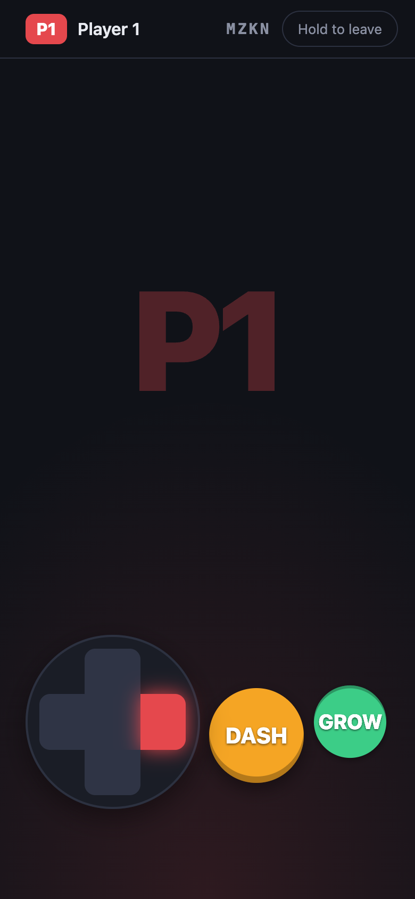

# Joinstick

Turn phones into gamepads for browser games. The game shows a QR code per
player; players scan it and their phone is a controller. No app, no account,
one small self-hosted Node server.

Made for couch play on a laptop or TV, with a plain JSON/WebSocket protocol
that also works for remote players.

<p align="center"></p>

## Quick start (30 seconds)

Joinstick is not on npm yet, so run it from a clone (Node 22+):

```sh
git clone https://github.com/raprav/joinstick && cd joinstick && npm install
node src/cli.js --static examples/basic
```

Open `http://localhost:3000` on the computer, scan a QR code with a phone on
the same Wi-Fi, and move the square.

## Add it to your game

```sh
node path/to/joinstick/src/cli.js --static ./my-game
# or: npm i <git url or path to the checkout>, then npx joinstick --static ./my-game
```

```js
import { host } from '/joinstick/host.js';

const room = await host({ slots: 2, layout: { buttons: [{ id: 'punch', label: 'P' }, { id: 'kick', label: 'K' }] } });
qrImage1.src = room.qr(1);  qrText1.textContent = room.joinUrl(1);

function frame() {
  requestAnimationFrame(frame);
  const p1 = room.input(1);                      // read every frame, even while paused
  if (!room.connected(1)) return showPaused();   // { x, y, buttons, pressed } is never undefined
  player1.move(p1.x, p1.y);                      // x, y in [-1, 1], y = -1 is up
  if (p1.pressed.punch) player1.punch();         // pressed = went down since last read
}
frame();
```

Coding agents (and humans who like checklists): read [AGENTS.md](AGENTS.md).
It has the full API, the input contract, layouts, pad customization, error
codes, pitfalls and how to test without phones (drive pads from a script
with `/joinstick/client.js`). A running server also serves it condensed at `/llms.txt`.

## CLI

```
joinstick [--port 3000] [--static ./dir] [--public-url URL]
```

| Flag | Env | |
|---|---|---|
| `--port` | `PORT` | Port to listen on. Default 3000. |
| `--static <dir>` | | Also serve your game from this directory. |
| `--public-url <url>` | `PUBLIC_URL` | Base URL phones should open, as an origin without a path. Default: the detected LAN address. |

Or embed it in your own Node server with `import { attach } from 'joinstick'`
(see AGENTS.md).

## How it works

```
  laptop / TV                     Joinstick server                 phones
 ┌─────────────┐   WebSocket    ┌──────────────────┐  WebSocket   ┌────────┐
 │ game page   │ ─────────────► │ rooms, slots,    │ ◄─────────── │ /j/KQZX/1
 │ host.js     │ ◄───────────── │ relay, QR codes, │ ───────────► │ pad page
 │ input(n)    │  input, join,  │ pad page, SDKs   │  pad state,  │ client.js
 └─────────────┘  leave         └──────────────────┘  messages    └────────┘
```

- The game creates a room (`KQZX`) with N slots. Each slot has a QR code
  that opens `/j/KQZX/<slot>` on a phone.
- The phone sends its full controller state on every change; the server
  relays it to the game, which polls `room.input(n)` each frame.
- Phones that lock or lose Wi-Fi leave at once (the game can pause) and
  rejoin the same slot by themselves. Game page refreshes and server restarts
  are transparent: the room keeps its code.
- Anyone can type the URL instead: `http://<laptop-ip>:3000/j`, room code,
  player number.

The wire protocol is in [PROTOCOL.md](PROTOCOL.md). For custom phone UIs or
remote clients use `/joinstick/client.js`.

## Remote play and HTTPS

- Phones must reach the server. On a LAN, plain HTTP is fine (no wake lock,
  no iOS fullscreen, vibration only on Android).
- For players outside your network, use a tunnel and tell Joinstick its URL:

  ```sh
  cloudflared tunnel --url http://localhost:3000
  node src/cli.js --static ./my-game --public-url https://<name>.trycloudflare.com
  ```

- Room codes are 4 letters, so on a public URL they can be guessed. Fine for
  playing with friends; there is no other authentication.

- A game served over HTTPS cannot talk to a `ws://` server (mixed content):
  serve the game with `--static`, or put both behind HTTPS.
- In Docker, LAN detection sees the container network: pass `--public-url`.

## Requirements

Node.js 22 or newer. Runtime dependencies: `ws` and `uqr`. Browser files are
plain ES modules with no build step.

## License

MIT © 2026 Rafa Prats
